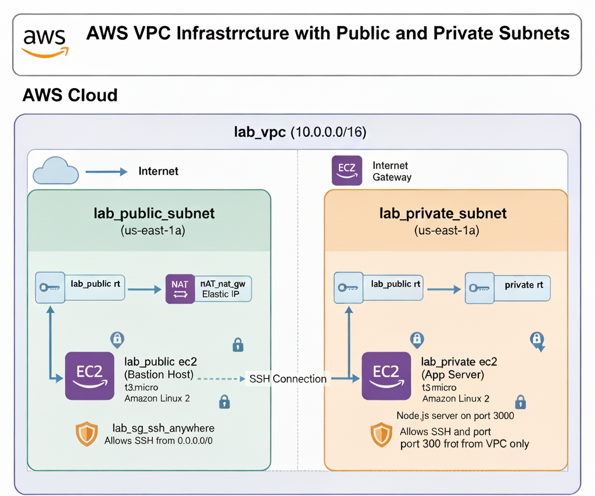

# AWS Terraform  



This project creates a VPC with public and private subnets, bastion host, and a private EC2 instance running a Node.js server.

## Prerequisites

- AWS CLI configured with credentials
- Terraform installed
- SSH key pair created in AWS

## Setup

### Option 1: Local Testing (Recommended for development)

1. Create a `terraform.tfvars` file for local testing:
```hcl
aws_region    = "us-east-1"
key_pair_name = "your-actual-key-pair-name"
```

2. Create a `backend.tfvars` file:
```hcl
bucket         = "your-s3-bucket-name"
dynamodb_table = "your-dynamodb-table-name"
```

3. Initialize Terraform:
```bash
terraform init -backend-config="backend.tfvars"
```

4. Apply the configuration:
```bash
terraform apply
```

### Option 2: Without tfvars files (Pass variables via CLI)

```bash
terraform init -backend-config="bucket=your-bucket" -backend-config="dynamodb_table=your-table"
terraform apply -var="key_pair_name=your-key-pair-name" -var="aws_region=us-east-1"
```

### Option 3: Environment Variables

```bash
export TF_VAR_key_pair_name="your-key-pair-name"
export TF_VAR_aws_region="us-east-1"
terraform init -backend-config="backend.tfvars"
terraform apply
```

## Architecture

- **VPC**: 10.0.0.0/16
- **Public Subnet**: 10.0.1.0/24 (Bastion host)
- **Private Subnet**: 10.0.2.0/24 (App server with Node.js)
- **NAT Gateway**: Allows private subnet internet access
- **Internet Gateway**: Provides internet access for public subnet
- **Security Groups**: 
  - Public EC2: SSH from anywhere (0.0.0.0/0)
  - Private EC2: SSH and port 3000 from VPC only

## Resources Created

- 1x VPC
- 2x Subnets (1 public, 1 private)
- 1x Internet Gateway
- 1x NAT Gateway with Elastic IP
- 2x Route Tables with associations
- 2x Security Groups
- 2x EC2 instances (t3.micro)

## Access

### SSH to Bastion Host
```bash
ssh -i ~/.ssh/your-key.pem ec2-user@<bastion-ip>
```

### SSH to Private Instance via Bastion (ProxyJump)
```bash
ssh -i ~/.ssh/your-key.pem -J ec2-user@<bastion-ip> ec2-user@<private-ip>
```

### Alternative: SSH with Agent Forwarding
```bash
# First, add key to SSH agent
ssh-add ~/.ssh/your-key.pem

# SSH to bastion
ssh -A ec2-user@<bastion-ip>

# Then from bastion to private instance
ssh ec2-user@<private-ip>
```

### Test Node.js Server
From the bastion host:
```bash
curl http://<private-ip>:3000
```

You should see: `Hello from Private EC2 Instance!`

## Outputs

After applying, Terraform will output:
- `bastion_public_ip`: Public IP of the bastion host
- `app_private_ip`: Private IP of the application server

View outputs anytime:
```bash
terraform output
```

## Clean Up

To destroy all resources:
```bash
terraform destroy
```

## Notes

- The Node.js server starts automatically on the private EC2 instance
- Check `/home/ec2-user/server.log` on the private instance for Node.js logs
- NAT Gateway charges apply even when idle - remember to destroy resources when not in use

## Troubleshooting

### Node.js server not running
SSH to the private instance and check:
```bash
# Check if Node.js is installed
node --version

# Check if server is running
ps aux | grep node

# Check server logs
cat ~/server.log

# Manually start if needed
cd /home/ec2-user
node server.js
```

### Cannot SSH to private instance
1. Verify bastion host is accessible
2. Check security group rules in [`sg.tf`](sg.tf)
3. Ensure key pair name matches in both AWS and `terraform.tfvars`
4. Verify private instance has proper route table association